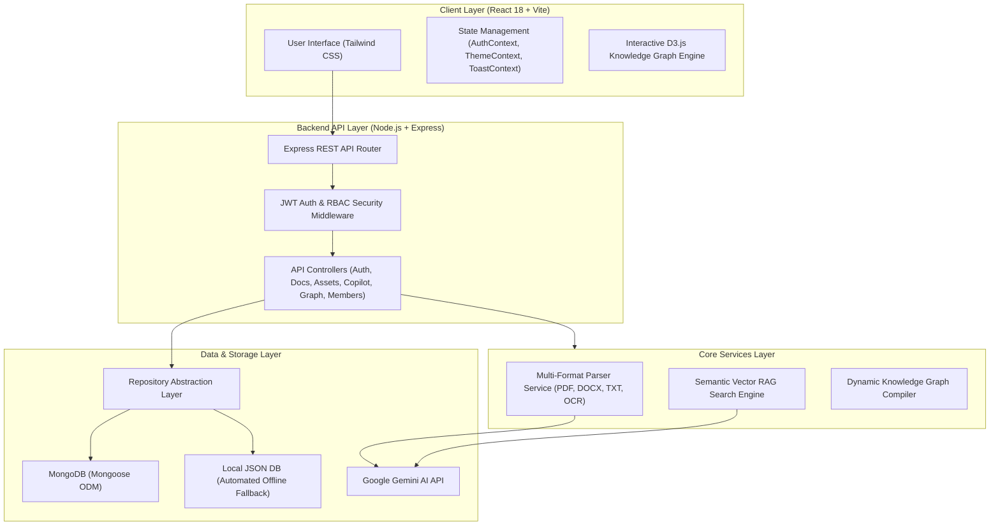
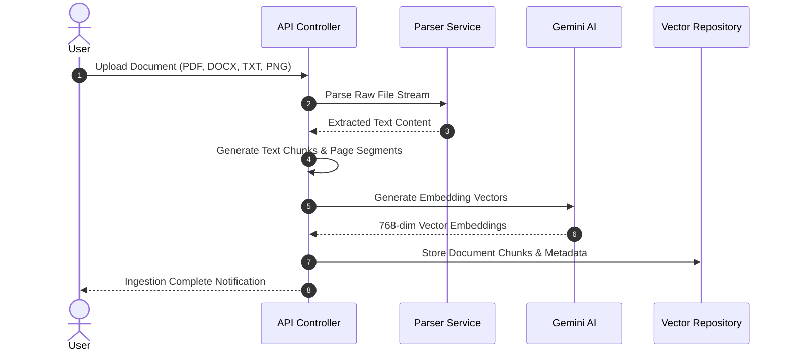
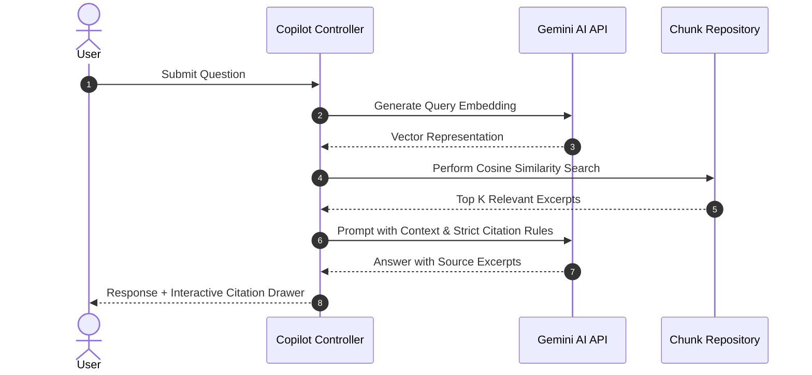

# 🏗️ SamiQ System Architecture

This document provides a detailed technical overview of the system architecture, component design, data flow pipelines, and design patterns used in **SamiQ — Universal AI Workspace & Knowledge Engine**.

---

## 📐 1. High-Level Architecture

SamiQ uses a modular, layered full-stack architecture built with TypeScript. It separates client-side state rendering from backend REST API services, implementing a **Layered Repository Pattern** for pluggable database infrastructure.



---

## 🏛️ 2. Component Architecture

### 2.1 Frontend Architecture (`frontend/src`)
- **App Layout Container (`DashboardLayout.tsx`)**: Controls global sidebar state, navbar user profile navigation, and theme mode toggles (`Light` / `Dark`).
- **Context State Managers**:
  - `AuthContext.tsx`: Manages active user authentication session, token persistence, and login/logout state.
  - `ThemeContext.tsx`: Controls HSL corporate color tokens and dark/light CSS root variables.
  - `ToastContext.tsx`: Displays non-intrusive floating toast notifications at `z-[99999]` z-index.
- **Knowledge Graph Explorer (`GraphPage.tsx`)**: Powered by **D3.js Force Simulation** using custom forces (`forceManyBody`, `forceCollide`, `forceLink`, `forceCenter`, `forceX`, `forceY`). It renders dynamic SVG/Canvas nodes with an inspector drawer.

---

### 2.2 Backend Architecture (`backend/src`)
The backend is structured around the **Repository Pattern**, decoupling business logic from underlying database implementations.

```
Controllers  ──>  Repository Interfaces (IUserRepository, IDocumentRepository, etc.)
                          ├──> Mongoose Implementation (MongoDB)
                          └──> JSON Implementation (Local File System Fallback)
```

- **Database Resilience**: On server initialization (`server.ts`), `connectDB()` attempts connection to MongoDB. If unavailable, it seamlessly falls back to `JsonRepository` reading/writing `backend/db.json`.

---

## 🔄 3. Core Data Flow Pipelines

### 3.1 Document Ingestion & Vector Chunking Pipeline


---

### 3.2 Semantic RAG Query Pipeline


---

### 3.3 Dynamic Knowledge Graph Generation Pipeline
1. **Entity Aggregation**: Queries active registered members, organizational assets, uploaded documents, document chunks, and audit logs.
2. **Node Resolution**: Normalizes entities into unique node objects (`department`, `user`, `asset`, `document`, `log`).
3. **Relationship Resolution**:
   - `member_of`: User → Department
   - `belongs_to`: Asset → Department
   - `uploaded_by`: Document → User
   - `mentions`: Document Chunk → Asset (Resolved via text scan)
   - `triggered_by`: Activity Log → User
   - `concerns`: Activity Log → Target Entity
4. **D3 Rendering**: Generates physics simulation graph payload for the frontend interactive canvas.

---

## 🛡️ 4. Security & Access Control

- **JSON Web Tokens (JWT)**: Auth tokens signed with `JWT_SECRET` issued upon authentication.
- **Route Authorization Guards (`auth.ts`)**: Restricts administrative endpoints (`/auth/members`, `/documents/:id` deletion, settings updates) to users with `admin` role.
- **Audit Logging (`activityLogRepository`)**: Logs critical actions (`UPLOAD_DOCUMENT`, `DELETE_DOCUMENT`, `ASK_COPILOT`, `UPDATE_MEMBER`) for workspace accountability.

---

## ⚙️ 5. Deployment Topology

```
┌─────────────────────────────────────────────────────────────┐
│                       Client Browser                        │
│                 React 18 + Vite Web App                     │
└──────────────────────────────┬──────────────────────────────┘
                               │ HTTPS / REST API
┌──────────────────────────────▼──────────────────────────────┐
│                    Node.js + Express Backend                │
│ ┌──────────────────────┐ ┌────────────────────────────────┐ │
│ │ Document Parser Engine│ │ RAG Vector Embedding Controller│ │
│ └──────────────────────┘ └────────────────────────────────┘ │
└──────────────┬──────────────────────────────┬───────────────┘
               │ MongoDB / JSON               │ REST API
┌──────────────▼──────────────┐ ┌─────────────▼──────────────┐
│      MongoDB Database       │ │    Google Gemini AI API    │
└─────────────────────────────┘ └────────────────────────────┘
```
